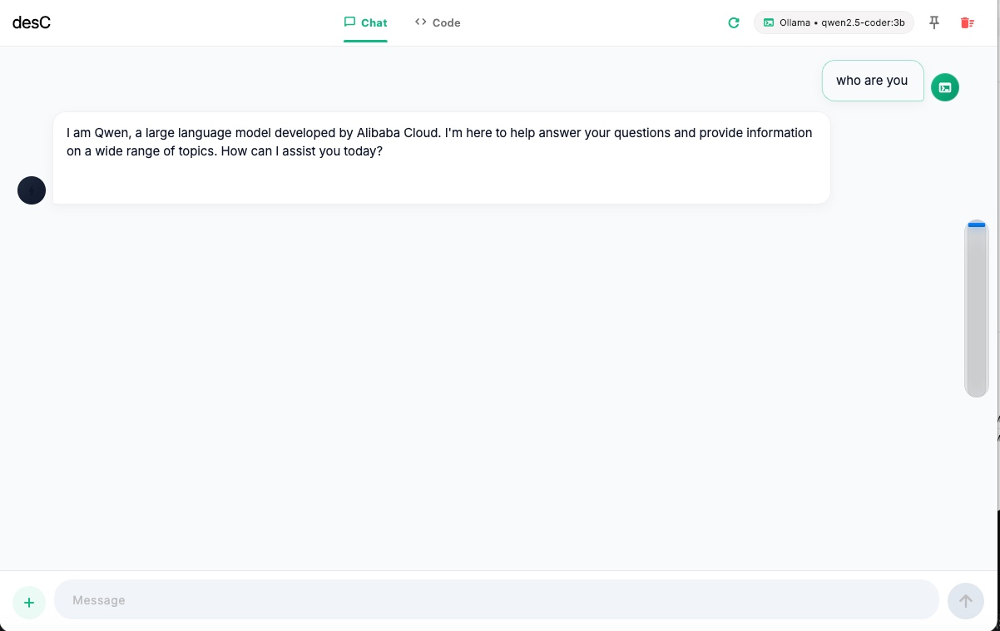
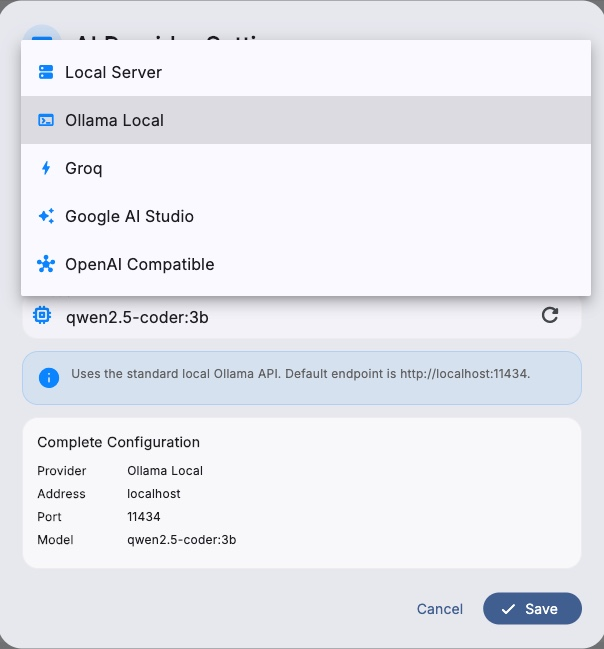
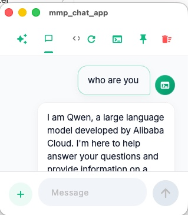
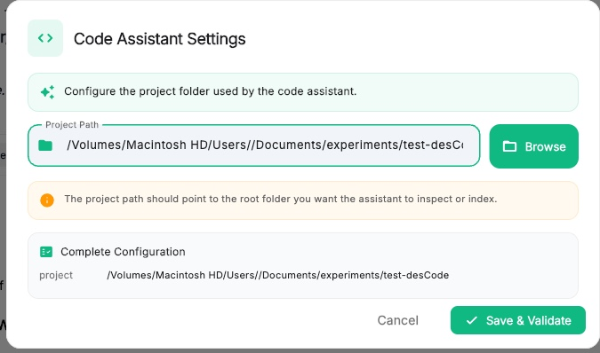
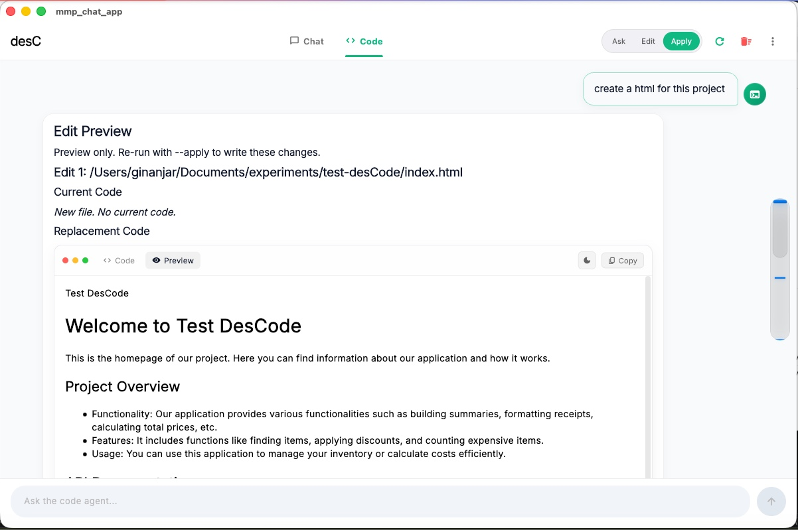

# desC

**desC** is a desktop AI assistant for **macOS**, **Windows**, and **Linux**.

It combines a clean LLM chat interface with a project-aware assistant for **code** and **document** folders using advanced contextual RAG.

desC includes a local default model:

- **LLM:** `qwen2.5-coder:1.5b-instruct`

You can also connect desC to external providers such as **Groq**, **Google Gemini**, **OpenAI-compatible endpoints**, or your own local LLM server.

---

> ⚠️ **Unsigned Application Notice**
>
> desC is currently an **unsigned application**.
>
> macOS and Windows will show a security warning on first launch.
> This is expected.
>
> Follow the platform-specific instructions below to allow the app to run.

---

> 📦 **First Launch — Model Download**
>
> On first startup, desC will automatically download the required **LLM and embedding models** for chat and RAG features.
>
> Default local model:
>
> ```text
> qwen2.5-coder:1.5b-instruct
> ```
>
> Approximate download size: **~2 GB**
>
> Please make sure you have:
>
> - A stable internet connection
> - Enough disk space
> - Time for the first startup download to complete
>
> Do not close the app during the initial model download.

---

## Screenshots

### Chat



### Chat Server Settings



### Pinned Window



### Code Settings



### Project-Aware HTML Generation



---

## Features

- **Chat with a local or remote LLM server**
- **Default local model:** `qwen2.5-coder:1.5b-instruct`
- **Project-aware code assistant**
- **Document folder support**
- **Advanced contextual RAG**
- **Project indexing**
- **Ask, Edit, and Apply modes**
- **Clipboard preview and attachment**
- **Always-on-top pinned window**
- **Chat minimap for long conversations**
- **Dark and light theme support**
- **macOS, Windows, and Linux support**

---

## Getting Started

### 1. Download desC

Download the latest binary for your platform from the **Releases** page.

Available builds:

- **macOS**
- **Windows**
- **Linux `.deb` package**

---

### 2. Run the app

Start desC by following the platform-specific instructions below.

Because desC is currently unsigned, macOS and Windows require additional first-launch steps.

---

### 3. Wait for model download

On first startup, desC will automatically download the required LLM and embedding models.

Default model:

```text
qwen2.5-coder:1.5b-instruct
```

Approximate download size:

```text
~2 GB
```

Do not close the app during this process.

---

## Running on macOS

desC for macOS is currently unsigned.

Because the app is not signed with an Apple Developer certificate, macOS Gatekeeper may block it on first launch.

### Option 1: Open from Finder

1. Download and extract the macOS release.
2. Locate `desC.app` in Finder.
3. Right-click or Control-click `desC.app`.
4. Select **Open**.
5. macOS will show a warning that the app is from an unidentified developer.
6. Click **Open**.

You usually only need to do this once.

---

### Option 2: Allow from Security Settings

If macOS blocks the app completely:

1. Try to open `desC.app`.
2. macOS will show a message saying the app cannot be opened.
3. Open **System Settings**.
4. Go to **Privacy & Security**.
5. Scroll down to the **Security** section.
6. Look for the message about `desC.app`.
7. Click **Open Anyway**.
8. Confirm by clicking **Open**.

---

### Option 3: Remove the quarantine flag

If the app still does not open, you can remove the macOS quarantine flag manually.

Open Terminal and run:

```bash
xattr -cr /path/to/desC.app
```

Example:

```bash
xattr -cr ~/Downloads/desC.app
```

Then open the app again.

---

## Running on Windows

desC for Windows is currently unsigned.

Because the app is not signed with a trusted code-signing certificate, Windows Defender SmartScreen may show a warning.

---

### Option 1: Run anyway from SmartScreen

1. Download the Windows release.
2. Run `desC.exe`.
3. Windows may show a blue warning screen:

```text
Windows protected your PC
```

4. Click **More info**.
5. Click **Run anyway**.

You usually only need to do this once per downloaded version.

---

### Option 2: Unblock the downloaded file

If Windows blocks the file after download:

1. Right-click `desC.exe`.
2. Select **Properties**.
3. Open the **General** tab.
4. At the bottom, look for a security message.
5. Check **Unblock**.
6. Click **Apply**.
7. Click **OK**.
8. Run `desC.exe` again.

---

### Option 3: Trust a local certificate on your machine

If your Windows build includes a local signing certificate, you may need to install and trust the certificate on your own machine.

> Only install certificates that come from a source you trust.

#### Install the certificate

1. Locate the certificate file included with the release.
   It may have an extension such as:

```text
.cer
.crt
.pfx
```

2. Double-click the certificate file.
3. Click **Install Certificate**.
4. Choose **Local Machine**.
5. Click **Next**.
6. Select **Place all certificates in the following store**.
7. Click **Browse**.
8. Choose:

```text
Trusted Root Certification Authorities
```

9. Click **OK**.
10. Click **Next**.
11. Click **Finish**.
12. Accept the Windows security prompt.

After installing the certificate, run `desC.exe` again.

---

### Alternative: Use Microsoft Management Console

If double-click installation does not work:

1. Press `Win + R`.
2. Type:

```text
mmc
```

3. Press Enter.
4. Go to **File** → **Add/Remove Snap-in**.
5. Select **Certificates**.
6. Click **Add**.
7. Choose **Computer account**.
8. Click **Next**.
9. Select **Local computer**.
10. Click **Finish**.
11. Click **OK**.
12. Expand:

```text
Certificates (Local Computer)
```

13. Right-click:

```text
Trusted Root Certification Authorities
```

14. Select **All Tasks** → **Import**.
15. Import the certificate file.
16. Complete the wizard.
17. Restart desC.

---

## Running on Linux

Linux releases are provided as a **Debian package**.

The AppImage version is no longer used.

### Install the `.deb` package

Download the Linux `.deb` file from the latest release, then install it using:

```bash
sudo apt install ./desC.deb
```

If the package name includes a version number, use the actual file name:

```bash
sudo apt install ./desC-linux-amd64.deb
```

---

### Run desC

After installation, you can launch desC from your application menu.

You can also run it from the terminal:

```bash
desc
```

If the command is not available, try:

```bash
desC
```

---

### Fix missing dependencies

If installation reports missing dependencies, run:

```bash
sudo apt --fix-broken install
```

Then install the package again:

```bash
sudo apt install ./desC.deb
```

---

### Uninstall on Linux

To remove desC:

```bash
sudo apt remove desc
```

If the package name is different, list installed packages with:

```bash
dpkg -l | grep -i desc
```

Then remove the matching package.

---

## First-Time Setup

### Chat Setup

Before using Chat:

1. Open the **Chat** tab.
2. Open the server/provider settings.
3. Choose your provider.
4. Enter your LLM server or API details.
5. Save the settings.
6. Start chatting.

---

### Code and Document Setup

Before using project-aware assistance:

1. Set up the LLM provider in the **Chat** tab.
2. Open the **Code** tab.
3. Open **Code Settings**.
4. Select your project directory.
5. Save and validate the settings.
6. Click **Index project**.
7. Ask questions about your code or documents.

Example prompts:

```text
Explain this project structure.
```

```text
Generate an HTML page based on this project.
```

```text
Summarize the documents in this folder.
```

```text
Find possible bugs in this codebase.
```

```text
Create documentation for this project.
```

---

## Code Assistant Modes

| Mode | Use |
| --- | --- |
| **Ask** | Ask questions about code or documents |
| **Edit** | Request changes, rewrites, or improvements |
| **Apply** | Apply or execute project-aware tasks |

---

## Supported Providers

desC supports multiple LLM providers and server types:

- Local server
- Ollama
- Groq
- Google Gemini
- OpenAI-compatible endpoints

---

## Recommended Free Third-Party Provider

If you do not want to run a local model, a recommended free third-party option is:

```text
Groq with gpt-oss-120
```

Groq can be useful if you want fast hosted inference without downloading a large local model.

To use Groq:

1. Create a Groq account.
2. Generate an API key.
3. Open desC.
4. Go to **Chat Server Settings**.
5. Select **Groq**.
6. Enter your API key.
7. Select:

```text
gpt-oss-120
```

8. Save the settings.
9. Start chatting.

---

## Default Local Model

desC uses the following default local model:

```text
qwen2.5-coder:1.5b-instruct
```

This model is downloaded automatically on first launch together with the required embedding model.

The local model is useful for:

- Coding assistance
- Local chat
- Project-aware code questions
- Document-based RAG
- Offline or private workflows after setup

---

## Notes

- desC is currently unsigned on macOS and Windows.
- macOS users may need to allow the app in **System Settings** → **Privacy & Security**.
- Windows users may need to click **Run anyway**, unblock the file, or install a local trusted certificate.
- Linux users should install the `.deb` package instead of using an AppImage.
- The Code tab uses the LLM server configured in the Chat tab.
- Index your project before asking project-specific questions.
- Both code repositories and document folders are supported.
- First launch may take time because desC downloads the required local models.

---

## Troubleshooting

### macOS says the app is damaged

If macOS says the app is damaged or cannot be opened, remove the quarantine flag:

```bash
xattr -cr /path/to/desC.app
```

Then open the app again.

---

### Windows blocks the app

If Windows blocks the app:

1. Click **More info**.
2. Click **Run anyway**.

If that does not work:

1. Right-click `desC.exe`.
2. Open **Properties**.
3. Check **Unblock**.
4. Click **Apply**.
5. Run the app again.

If your release includes a certificate, install it under:

```text
Trusted Root Certification Authorities
```

for the **Local Machine**.

---

### Linux package does not install

Run:

```bash
sudo apt --fix-broken install
```

Then retry:

```bash
sudo apt install ./desC.deb
```

---

### Project questions do not work

Make sure you have:

1. Set up the LLM provider in the **Chat** tab.
2. Selected a project folder in **Code Settings**.
3. Clicked **Index project**.
4. Waited for indexing to finish.

---

## License

Add your license information here.
