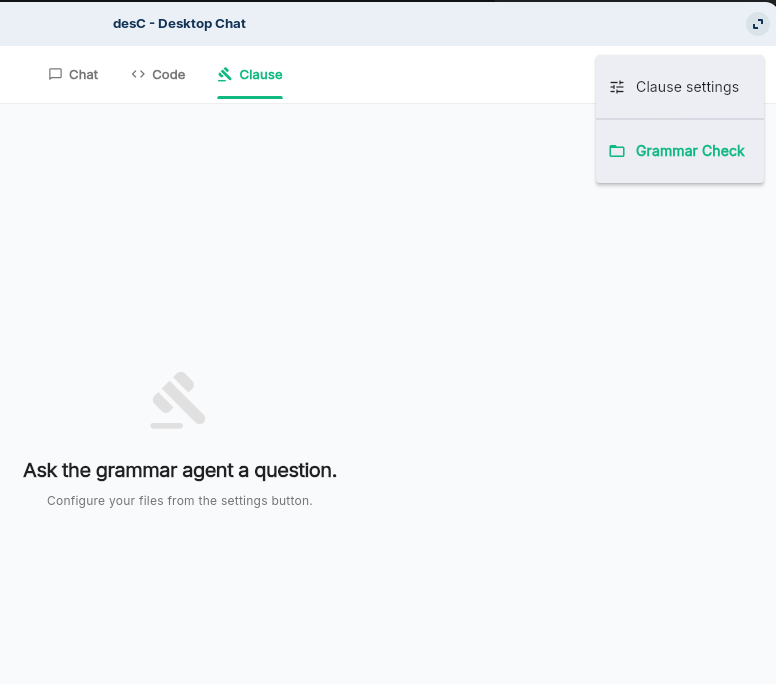
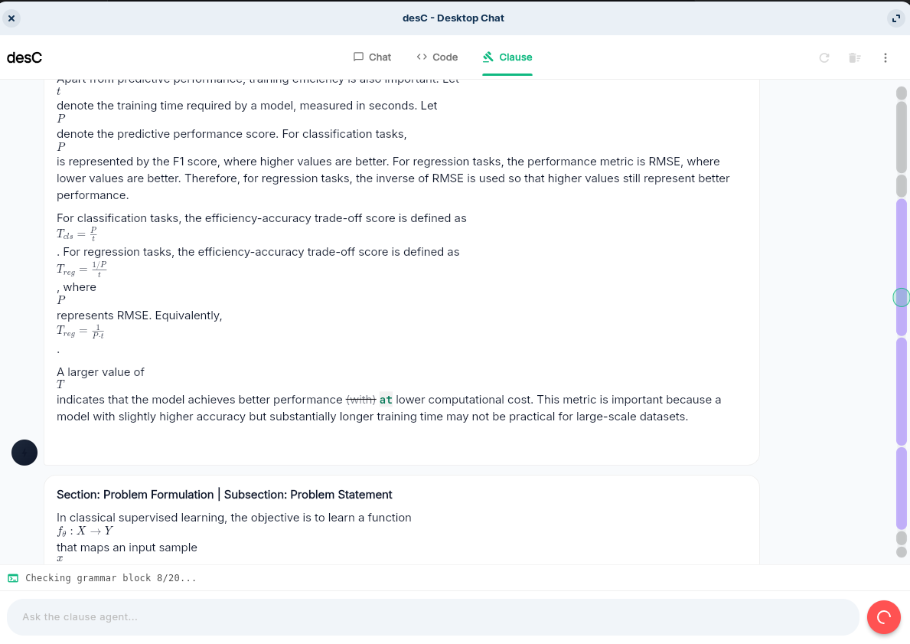
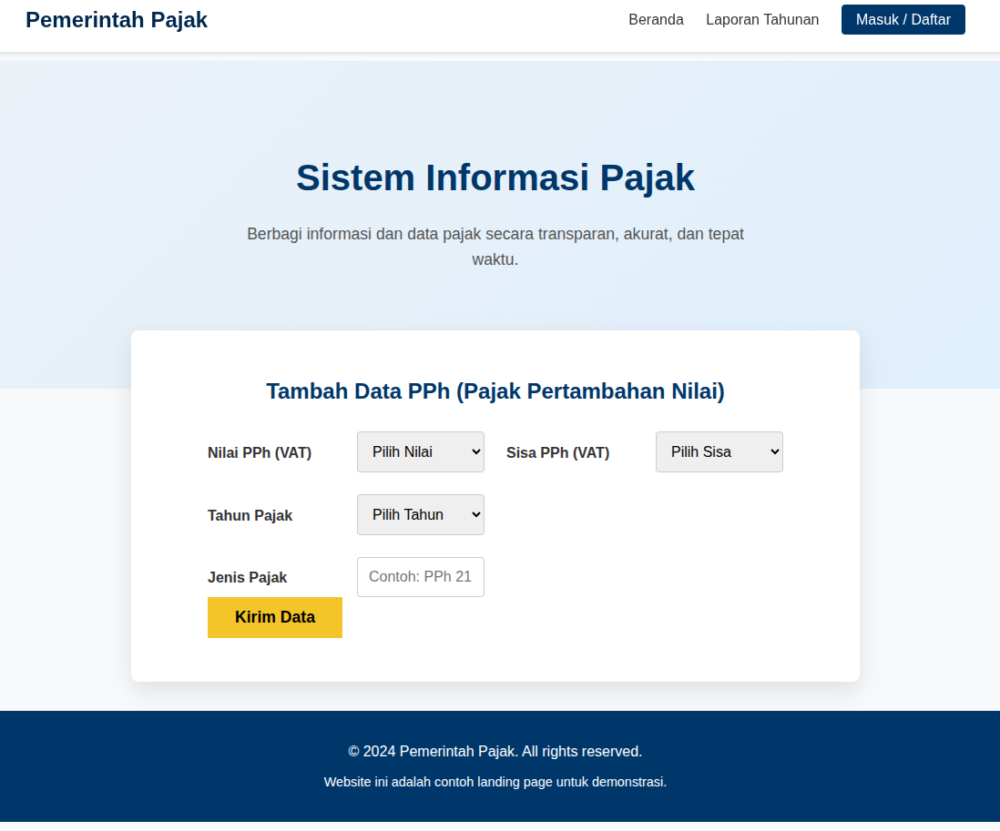
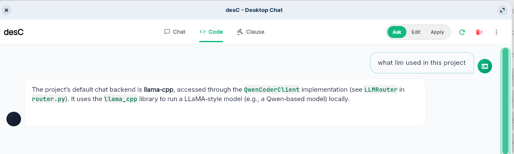

# desC

**desC** is a desktop AI assistant for **macOS**, **Windows**, and **Linux**.

It combines a clean LLM chat interface with a project-aware assistant for **code**, **documents**, and local workflows using contextual on-device search and RAG-style reasoning.

desC is designed to be useful even with small local models, while also supporting external LLM providers such as **Groq**, **Google Gemini**, **OpenAI-compatible endpoints**, and local LLM servers.

---

## Highlights

- Desktop AI assistant for **macOS**, **Windows**, and **Linux**
- Local on-device chat and project-aware assistance
- Codebase and document search without remote indexing
- Improved local codebase reasoning
- Optional external LLM provider support
- Local grammar checking
- Image support for on-device desC workflows, depending on machine capability
- Standard OS installation process
- Lightweight default on-device model setup
- Works with local models or hosted APIs

---

## Local On-Device Features

desC includes local on-device features for private and lightweight workflows.

### Local Grammar Check

desC now includes a **local grammar check** feature under **Clause**.

The grammar checker runs on your device, so text can be checked locally without needing to send it to an external API.

Local grammar model:

```text
T5-Grammar
```

Approximate size:

```text
300 MB
```

---

### On-Device desC Model

The current on-device desC model setup uses:

| Model | Size | Purpose |
| --- | ---: | --- |
| `qwen3.5:2b` | ~1.4 GB | Local LLM reasoning |
| `T5-Grammar` | ~300 MB | Local grammar checking |
| `snowflake` | ~100 MB | Local embedding/search support |

Approximate memory usage when using the on-device desC model:

```text
~2 GB RAM
```

> `qwen3.5:2b` can be a bit slow on some machines, but it is reliable for lightweight local workflows.

---

## Small Model, Surprisingly Useful

desC is designed to make small local models practical.

By combining a lightweight on-device LLM with contextual search, local reasoning, and focused assistant modes, desC can provide useful code and document assistance without requiring a large model or high-end hardware.

This means you can use local AI features for many everyday workflows while keeping the setup lightweight.

---

## External Provider Support

You can also connect desC to external providers such as:

- Local server
- Ollama
- Groq
- Google Gemini
- OpenAI-compatible endpoints

Using an external LLM can improve speed and reasoning quality, especially for larger projects or more complex questions.

---

## Codebase Search Improvements

desC no longer requires traditional codebase indexing for search.

Instead, desC improves local on-device codebase reasoning so that it can search, inspect, and reason over project files more directly.

This helps reduce unnecessary API calls when a user has an LLM API configured.

For example, desC is being tested on vague search tasks across large codebases with multiple confusing settings. In these cases, desC can often identify the correct answer locally without exhausting the Groq API.

---

## Image Support

desC now includes support for image-based on-device workflows.

Image support depends on your machine capability and the local model configuration available on your system.

---

## Installation Improvements

The installation process has been improved to follow each operating system’s standard installation flow.

There is no longer a need for manual copy-and-install steps.

Supported packages:

- **macOS:** `.dmg` or `.app` release package
- **Windows:** installer or executable release package
- **Linux:** `.deb` package

---

## Unsigned Application Notice

> ⚠️ **desC is currently an unsigned application.**

Because desC is not yet signed with platform-specific developer certificates, macOS and Windows may show security warnings on first launch.

This is expected.

Follow the platform-specific instructions below to allow the app to run.

---

## First Launch — Model Download

On first startup, desC may automatically download the required local models for chat, grammar checking, embeddings, and local assistant features.

Approximate total download size:

```text
~2 GB
```

Please make sure you have:

- A stable internet connection
- Enough disk space
- Time for the first startup download to complete

> Do not close the app during the initial model download.

---

## Screenshots

<table>
  <tr>
    <td width="33%">
      <h3 align="center">Chat</h3>
      
    </td>
    <td width="33%">
      <h3 align="center">Chat Server Settings</h3>
      
    </td>
    <td width="33%">
      <h3 align="center">Pinned Window</h3>
      
    </td>
  </tr>
  <tr>
    <td width="33%">
      <h3 align="center">Code Settings</h3>
      
    </td>
    <td width="33%">
      <h3 align="center">Project-Aware HTML Generation</h3>
      
    </td>
    <td width="33%">
      <h3 align="center">Clause Grammar Settings</h3>
      
    </td>
  </tr>
  <tr>
    <td width="33%">
      <h3 align="center">Grammar Results</h3>
      
    </td>
    <td width="33%">
      <h3 align="center">Code on Foreign Language</h3>
      
    </td>
    <td width="33%">
      <h3 align="center">Code Assistant</h3>
      
    </td>
  </tr>
</table>

---

## Getting Started

### 1. Download desC

Download the latest binary for your platform from the **Releases** page.

Available builds:

- **macOS**
- **Windows**
- **Linux `.deb` package**

---

### 2. Install desC

Install desC using the standard installation method for your operating system.

- On **macOS**, open the release package and install desC normally.
- On **Windows**, run the installer or executable.
- On **Linux**, install the `.deb` package.

---

### 3. Start desC

Launch desC from your application menu, desktop shortcut, or terminal depending on your operating system.

---

### 4. Wait for model download

On first startup, desC may download the required on-device models.

Approximate download size:

```text
~2 GB
```

Do not close the app during this process.

---

## Running on macOS

desC for macOS is currently unsigned.

Because the app is not signed with an Apple Developer certificate, macOS Gatekeeper may block it on first launch.

### Option 1: Open from Finder

1. Download and install the macOS release.
2. Locate `desC.app` in Finder.
3. Right-click or Control-click `desC.app`.
4. Select **Open**.
5. macOS will show a warning that the app is from an unidentified developer.
6. Click **Open**.

You usually only need to do this once.

---

### Option 2: Allow from Security Settings

If macOS blocks the app completely:

1. Try to open `desC.app`.
2. macOS will show a message saying the app cannot be opened.
3. Open **System Settings**.
4. Go to **Privacy & Security**.
5. Scroll down to the **Security** section.
6. Look for the message about `desC.app`.
7. Click **Open Anyway**.
8. Confirm by clicking **Open**.

---

### Option 3: Remove the quarantine flag

If the app still does not open, remove the macOS quarantine flag manually.

Open Terminal and run:

```bash
xattr -cr /path/to/desC.app
```

Example:

```bash
xattr -cr ~/Downloads/desC.app
```

Then open the app again.

---

## Running on Windows

desC for Windows is currently unsigned.

Because the app is not signed with a trusted code-signing certificate, Windows Defender SmartScreen may show a warning.

### Option 1: Run anyway from SmartScreen

1. Download the Windows release.
2. Run desC.
3. Windows may show a blue warning screen:

```text
Windows protected your PC
```

4. Click **More info**.
5. Click **Run anyway**.

You usually only need to do this once per downloaded version.

---

### Option 2: Unblock the downloaded file

If Windows blocks the file after download:

1. Right-click the desC executable or installer.
2. Select **Properties**.
3. Open the **General** tab.
4. At the bottom, look for a security message.
5. Check **Unblock**.
6. Click **Apply**.
7. Click **OK**.
8. Run desC again.

---

## Running on Linux

Linux releases are provided as a **Debian package**.

The AppImage version is no longer used.

### Install the `.deb` package

Download the Linux `.deb` file from the latest release, then install it using:

```bash
sudo apt install ./desC.deb
```

If the package name includes a version number, use the actual file name:

```bash
sudo apt install ./desC-linux-amd64.deb
```

---

### Run desC

After installation, launch desC from your application menu.

You can also run it from the terminal:

```bash
desc
```

If the command is not available, try:

```bash
desC
```

---

### Fix missing dependencies

If installation reports missing dependencies, run:

```bash
sudo apt --fix-broken install
```

Then install the package again:

```bash
sudo apt install ./desC.deb
```

---

### Uninstall on Linux

To remove desC:

```bash
sudo apt remove desc
```

If the package name is different, list installed packages with:

```bash
dpkg -l | grep -i desc
```

Then remove the matching package.

---

## First-Time Setup

### Chat Setup

Before using Chat:

1. Open the **Chat** tab.
2. Open the server/provider settings.
3. Choose your provider.
4. Enter your LLM server or API details.
5. Save the settings.
6. Start chatting.

---

### Code and Document Setup

Before using project-aware assistance:

1. Set up the LLM provider in the **Chat** tab.
2. Open the **Code** tab.
3. Open **Code Settings**.
4. Select your project or document directory.
5. Save and validate the settings.
6. Ask questions about your code or documents.

Example prompts:

```text
Explain this project structure.
```

```text
Find where authentication is configured.
```

```text
Why is the landing page using this layout?
```

```text
Summarize the documents in this folder.
```

```text
Find possible bugs in this codebase.
```

```text
Create documentation for this project.
```

```text
Generate an HTML page based on this project.
```

---

## Clause Grammar Check

The **Clause** section includes local grammar checking.

You can use it to:

- Check grammar locally
- Review corrected sentences
- Improve written clauses or paragraphs
- Work without sending text to an external provider

The grammar checker runs on your device using the local grammar model.

---

## Code Assistant Modes

| Mode | Use |
| --- | --- |
| **Ask** | Ask questions about code or documents |
| **Edit** | Request changes, rewrites, or improvements |
| **Apply** | Apply or execute project-aware tasks |

---

## Supported Providers

desC supports multiple LLM providers and server types:

- Local server
- Ollama
- Groq
- Google Gemini
- OpenAI-compatible endpoints

---

## Recommended Free Third-Party Provider

If you do not want to run a local model, a recommended free third-party option is:

```text
Groq with gpt-oss-120
```

Groq can be useful if you want fast hosted inference without downloading a large local model.

To use Groq:

1. Create a Groq account.
2. Generate an API key.
3. Open desC.
4. Go to **Chat Server Settings**.
5. Select **Groq**.
6. Enter your API key.
7. Select:

```text
gpt-oss-120
```

8. Save the settings.
9. Start chatting.

---

## Default Local Models

desC uses lightweight local models for on-device workflows.

Current local model setup:

```text
qwen3.5:2b
T5-Grammar
snowflake
```

Approximate total size:

```text
~2 GB
```

Approximate memory usage:

```text
~2 GB RAM
```

These models are useful for:

- Local chat
- Grammar checking
- Coding assistance
- Document-based questions
- Local project-aware search
- Offline or private workflows after setup

---

## Notes

- desC is currently unsigned on macOS and Windows.
- macOS users may need to allow the app in **System Settings** → **Privacy & Security**.
- Windows users may need to click **Run anyway** or unblock the downloaded file.
- Linux users should install the `.deb` package instead of using an AppImage.
- The Code tab uses the LLM server configured in the Chat tab.
- Both code repositories and document folders are supported.
- First launch may take time because desC downloads the required local models.
- Image support depends on your machine capability.
- Local grammar checking is available under **Clause**.

---

## Troubleshooting

### macOS says the app is damaged

If macOS says the app is damaged or cannot be opened, remove the quarantine flag:

```bash
xattr -cr /path/to/desC.app
```

Then open the app again.

---

### Windows blocks the app

If Windows blocks the app:

1. Click **More info**.
2. Click **Run anyway**.

If that does not work:

1. Right-click the desC executable or installer.
2. Open **Properties**.
3. Check **Unblock**.
4. Click **Apply**.
5. Run the app again.

---

### Linux package does not install

Run:

```bash
sudo apt --fix-broken install
```

Then retry:

```bash
sudo apt install ./desC.deb
```

---

### Project questions do not work

Make sure you have:

1. Set up the LLM provider in the **Chat** tab.
2. Selected a project or document folder in **Code Settings**.
3. Saved and validated the settings.
4. Asked a clear question about the selected project or folder.

---

### Local model feels slow

The local model is designed to be lightweight and reliable, but performance depends on your machine.

If local inference is slow, you can:

- Use a hosted provider such as Groq
- Use a stronger local model
- Reduce the size of the selected project folder
- Close other memory-heavy applications

---

## License

Add your license information here.
