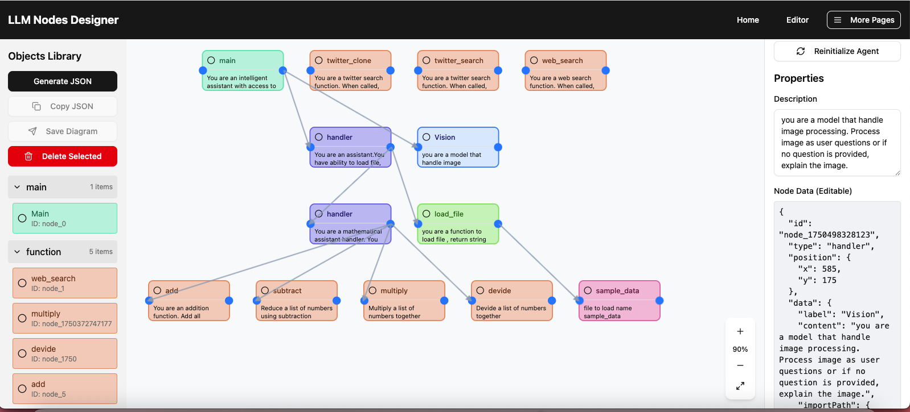
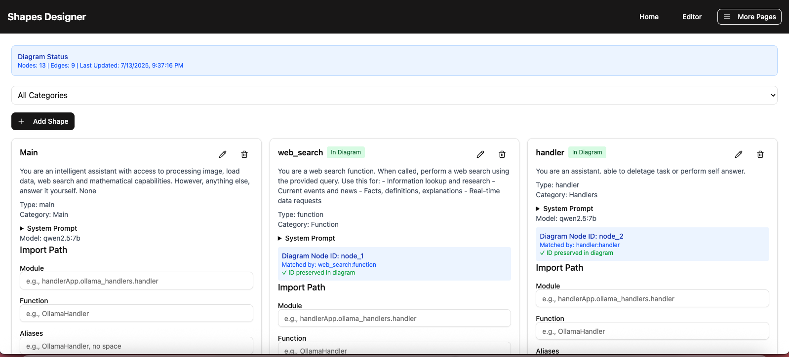
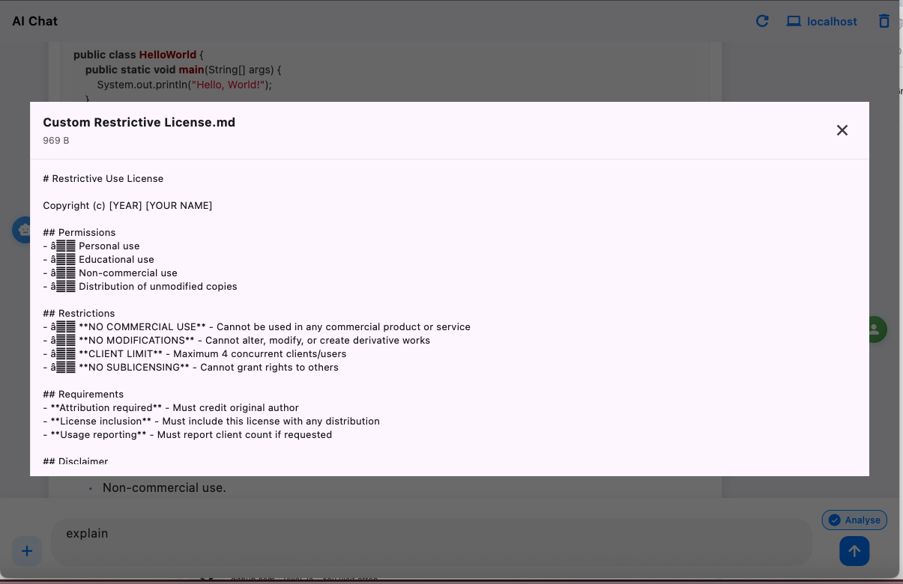
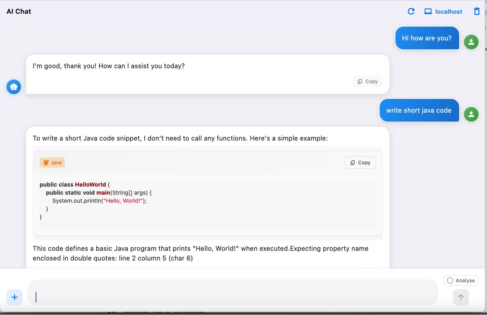
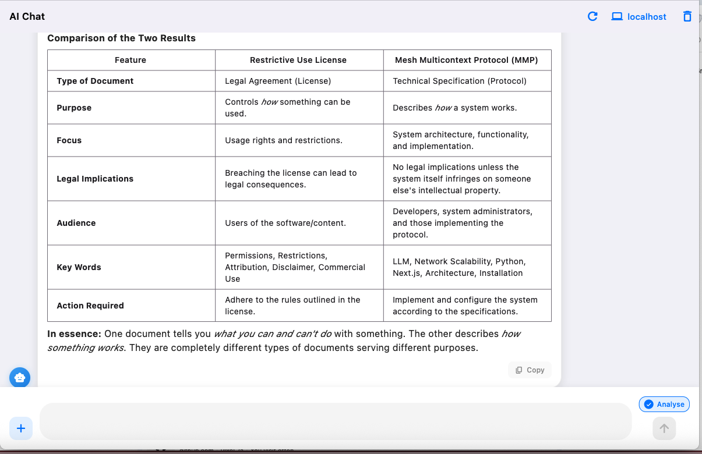
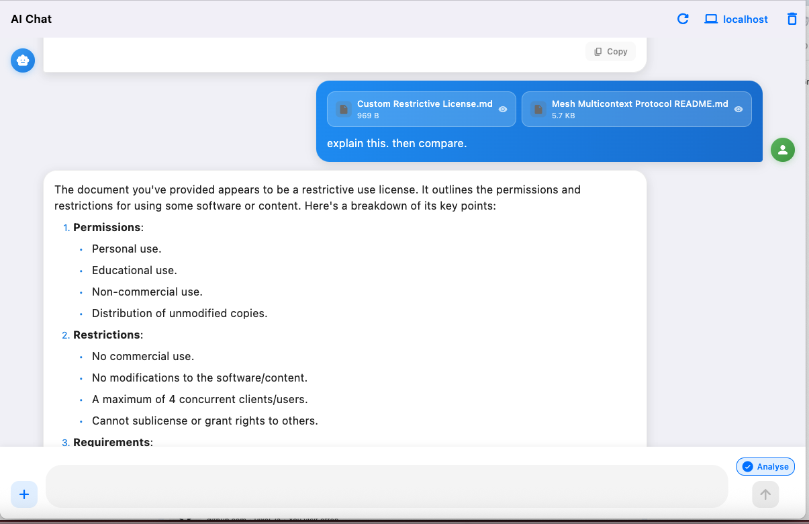
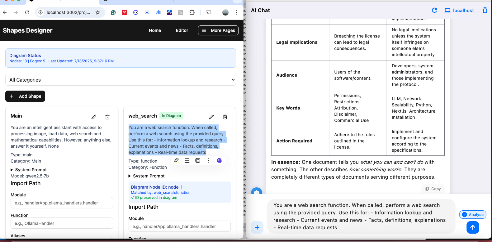
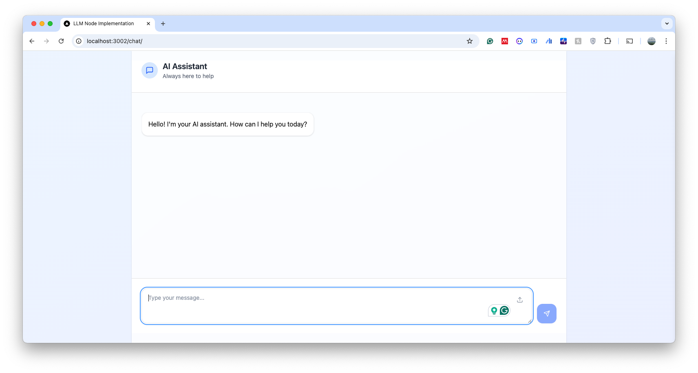
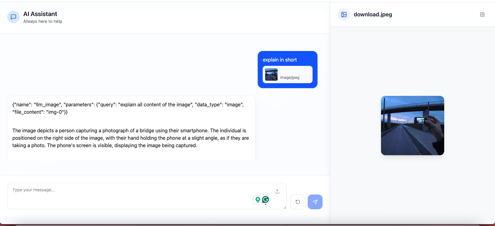
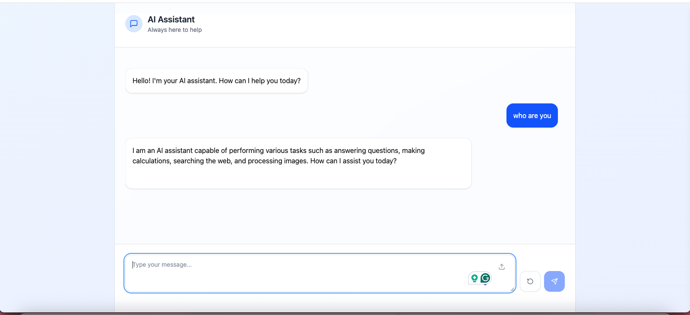

# Mesh Multicontext Protocol (MMP)

## Overview

This repository contains the implementation of the **Mesh Multicontext Protocol**, based on the research paper ["Centralisation and Decentralisation Strategy of Data Centre for Government in Response to Machine Learning Technology"](https://papers.ssrn.com/sol3/papers.cfm?abstract_id=5321083).

## Preview

### Server Interface
The MMP server provides a comprehensive web-based interface for managing your mesh network:


*Main dashboard showing the MMP network overview and status*


*Configuration editor for managing nodes, functions, and network settings*

### Client Applications
The MMP ecosystem includes both desktop and web clients for seamless interaction:

#### Desktop Client Features

*Main client interface showing conversation and function call capabilities*


*Client displaying AI responses with integrated function calls*


*Side-by-side comparison feature for analyzing different responses*


*File management interface for handling documents and data*


*Clipboard integration for easy data transfer and management*

#### Embedded Capabilities
The MMP supports embedded AI functionality across different contexts:


*Embedded interface integration in external applications*


*Image processing capabilities within embedded contexts*


*AI responses delivered through embedded interface*

## Abstract

The Mesh Multicontext Protocol addresses key challenges in modern data management:

- **Centralised data centres** face difficulties in managing the increasing size and diverse nature of evolving data
- **Machine learning algorithms** can effectively learn from data in a federated network setup, enhancing their performance and adaptability
- **A decentralised, yet centred mesh approach** strategy is well-suited to address both current and future changes in data management needs

This application implements a mesh data center with LLM functional call capabilities, providing a robust solution for organizations with limited data sharing capabilities.

## Key Benefits

1. **Modular Function Addition** - Add functional (Python) capabilities without affecting other nodes
2. **LLM Function Calls** - Users only need to call functions from web interface
3. **Network Scalability** - Can be interconnected with other MMP networks at larger scales
4. **Offline LLM Access** - Does not require internet access to use LLM capabilities
5. **Lightweight Implementation** - Can be implemented with small LLM models like QWEN2.5B

## Platform Compatibility

> **Development Note**: Due to development limitations, this project was built exclusively on **Mac Silicon (ARM)**. 

### Desktop Client Support
- **macOS Silicon**: Full backend support provided
- **iOS**: Backend support available (unsigned application)
- **Other Platforms**: Use web interface (see Web Interface Setup below)

### Web Interface Setup
For platforms other than macOS Silicon and iOS, you can use the web interface by starting a simple HTTP server:

```bash
python3 -m http.server 8080
```

Run this command within the `web` folder to serve the web interface locally.

## Use Cases

This MMP is particularly valuable for organizations with limited ability to share data both internally and externally:

### 1. On-Site AI Development
**Agency A** can build and generate LLM on-site with existing hardware infrastructure.

### 2. AI with Unprepared Data
**Agency A** has data that isn't AI-ready but wants to build AI capabilities. MMP can connect to files as RAG/CAG to build AI with context. Later, when data is ready, Agency A can replace data with new data without interrupting the whole ecosystem.

### 3. Knowledge Sharing Without Data Exposure
When needed, **Agency A** and **Agency B** can share knowledge without necessarily sharing the underlying data.

## System Architecture

The MMP consists of 4 main components:

### 1. Python Virtual Environment
Backend where MMP core functionality is built.

### 2. Next.js Server
Provides server implementation interface for Python backend.

### 3. Functions/Other Objects
User-provided functions to feed LLM function calls. Functions must be:
- Synchronous only
- Return string values only
- Arguments can be anything (must be specified in diagram.json)

### 4. Diagram.json
Configuration file where all setup is defined, including:
- MMP network configuration
- Function call definitions
- Can be edited manually or through Next.js interface

## Configuration Example

```json
{
  "id": "node_0",
  "type": "main", 
  "name": "main",
  "description": "You are an intelligent assistant with access to processing image, load data, web search and mathematical capabilities. try to breakdown mathematical operations then call functions . for example (3+7)9 means add [3,7] then multiply by 9. \nimportant : \n- do not modify promt when calling function.\n- use <function> </function> when calls functions.\n- However, question that is not related to above function, answer it yourself.",
  "importPath": {
    "module": "handlerApp.ollama_handlers.handler",
    "function": "OllamaHandler",
    "aliases": "OllamaHandler"
  },
  "parameters": {
    "query": {
      "type": "string",
      "description": "Query to send to Handler"
    }
  },
  "model": "qwen2.5:7b",
  "system_prompt": "When you need to call a function, use this EXACT format:\n<function_call>\n{\"name\": \"OllamaHandler\", \"parameters\": {\"query\": \"query\"}}\n</function_call>"
}
```

> **Note:** The `description` and `system_prompt` keys need to be very detailed as they determine how the LLM performs function calls.

## Installation Guide

### Prerequisites (Technical Knowledge Required)

1. **Ollama Setup**: Ollama must be running on the installed port with the following models:
   - `qwen2.5:7b` (Required - function calls)
   - `llama3.2-vision:latest` (Optional - vision capabilities)
   - `gemma3:12b` (Optional - final analysis)

### Server Installation Steps

1. Create Python virtual environment using `requirements.txt`
2. Edit `run-nextapp.sh` and configure the Python virtual environment section
3. Copy `data` folder and `python` folder at the same level as the server app
4. Run `run-nextapp.sh`
5. Installation complete!

## Network Architecture

The server opens three ports:

- **Port 3001**: Python backend (handles communication between Next.js and Python) - *Local only*
- **Port 3002**: User interface - *Public access*
- **Port 3003**: File server (serves diagram.json and shape.json to Next.js) - *Local only*

### Access Control
- Ports 3001 and 3003 are local-only
- Users can access port 3002 but cannot view or edit configuration
- Clients connect by adjusting IP in the provided UI (port locked to 3002)

## Additional Features

### Twitter Integration
The project includes Twitter implementation functionality with two files provided. To use Twitter features:

```bash
python twitterV1.py
```

> **Note:** You need to login to use Twitter functionality.

## Getting Started

### For macOS Silicon/iOS Users:
1. Follow the installation steps above
2. Use the provided desktop client
3. Configure your mesh network through the interface

### For Other Platforms:
1. Follow the installation steps above
2. Navigate to the `web` folder
3. Start the HTTP server: `python3 -m http.server 8080`
4. Access the interface via `http://localhost:8080`
5. Configure your mesh network through the web interface

### General Setup:
1. Add your custom functions and define them in diagram.json
2. Start building your decentralized AI ecosystem!

## Contact

For questions, support, or collaboration inquiries, please contact:
**Email**: [mambo06@gmail.com](mailto:mambo06@gmail.com)

## License

**"Mesh Multicontext Protocol"** by **Achmad Ginanjar** is licensed under [CC BY-NC-ND 4.0](https://creativecommons.org/licenses/by-nc-nd/4.0/)

## Research Paper

For detailed theoretical background, please refer to the original research paper:
[Centralisation and Decentralisation Strategy of Data Centre for Government in Response to Machine Learning Technology](https://papers.ssrn.com/sol3/papers.cfm?abstract_id=5321083)

---

**Enjoy building your mesh multicontext protocol network!** 🚀